# Web Scraping Refactor - Singapore Family Event Extractor

## Overview

Step-by-step (Arishya's method): 
1. Run main.py with the blog you want to scrape
2. then select from RSS feed, category scraping (pre-defined links), and your own link scrpaing
3. then it'll get all details, location, and put them in timsetamp folder with relevant & non-relevant
> To dedup across many folders, there's a script called "merge_and_dedup_2026.py", can run this once for the folders to dedup.
4. you can review them in review UI app
5. after you are done, you can validate them through validate script to make sure all images have local paths
6. for images, you can resize them using image.py script 
7. then upload images to s3 so apps team has access to them
8. there's format_json.py to format the jsons into correct structure
9. then use json_to_csv.py to convert all jsons under timsetamp folder to csv
10. csv used for review, updating id (manual), and ensure all details correct
11. after apps teams uploads content to app, upload new data to database
12. so first clean the csv using `cleaning_csv.py`, then upload using mysqlworkbench through sql query
13. so now database is updated for future dedupping 

This project is a comprehensive web scraping system designed to extract family-friendly event information from popular Singapore parenting and family blogs. The system automatically:

1. **Scrapes RSS/Atom feeds** from multiple Singapore family blogs
2. **Extracts event information** using Google's Gemini AI to identify family activities
3. **Geocodes event locations** using Google Places API
4. **Downloads event images** and organizes them by blog source
5. **Provides a web interface** for manual review and editing of extracted events
6. **Merges and exports** events to JSON format
7. **Uploads results to AWS S3** for storage and distribution

The system is built with a modular architecture to handle the entire pipeline from feed scraping to final event publication.

## Main Flow - 3 Scraping Modes

Run the main pipeline with:
```bash
python main.py
```

You'll see an interactive menu with **3 scraping modes**:

```
============================================================
🌐 WEB SCRAPING - EVENT EXTRACTION PIPELINE
============================================================

Select scraping mode:

  1. RSS Feed Scrape (Normal Flow)
     → Scrape latest articles from configured RSS feeds

  2. Category Page Scrape
     → Scrape articles from a predefined category page

  3. Single Article Scrape
     → Scrape events from a specific article URL you provide

  4. Exit
```

### Mode 1: RSS Feed Scrape (Normal Flow)
Scrapes the latest articles from configured RSS feeds for each blog.

```bash
# Process all blogs
python main.py
# Then select option 1

# Process specific blog with article limit
python main.py --blog honeykidsasia --max-articles 5
# Then select option 1

# Direct mode (skip menu)
python main.py --mode 1 --blog sassymamasg --max-articles 3
```

### Mode 2: Category Page Scrape
Scrapes articles from predefined category pages. Categories are configured in `config/config.json`.

```bash
python main.py
# Select option 2, then choose blog and category from the menu
```

**Example flow:**
```
Select a blog:
  1. bykido
  2. sassymamasg
  3. littledayout
  4. honeykidsasia 
  5. sunnycitykids

Enter blog number: 2

📂 SASSYMAMASG - Select a category:
  1. Family Events
  2. Eating Out
  3. Indoor Play
  4. Outdoor Activities

Enter category number: 1
```

### Mode 3: Single Article Scrape
Paste any article URL to extract events from it. Great for articles like "70+ Things To Do With Kids".

```bash
python main.py
# Select option 3, then paste the article URL

# Direct mode (skip menu)
python main.py --mode 3 --url "https://honeykidsasia.com/things-to-do-with-kids-during-school-holidays-singapore/"
```

## Pipeline Steps (All Modes)

All 3 scraping modes go through the same processing pipeline:

| Step | Description |
|------|-------------|
| 1. **Extract** | Gemini AI extracts events from article content |
| 2. **Deduplicate** | Semantic deduplication against database + within batch |
| 3. **Filter** | ML classifier filters relevant family events |
| 4. **Geocode** | Google Places API gets addresses & coordinates |
| 5. **Images** | Download and save event images |
| 6. **Save** | Save to `relevant/` and `non-relevant/` folders |
| 7. **Review** | Optional Streamlit web editor for manual review |
| 8. **Merge** | Combine all events into single JSON |
| 9. **Upload** | Upload to AWS S3 |

## Command Line Options

```bash
python main.py [OPTIONS]

Options:
  --blog BLOG           Process only a specific blog (e.g., --blog sassymamasg)
  --max-articles N      Limit articles per blog (e.g., --max-articles 5)
  --timestamp STAMP     Custom timestamp for output folder
  --mode {1,2,3}        Skip menu: 1=RSS, 2=Category, 3=Single Article
  --url URL             Article URL for --mode 3
```

**Examples:**
```bash
# Interactive menu
python main.py

# RSS scrape for specific blog
python main.py --mode 1 --blog bykido --max-articles 3

# Single article scrape (direct)
python main.py --mode 3 --url "https://example.com/article"

# Category scrape with max articles setting
python main.py --max-articles 5
# Then select option 2 and choose category
```

## Blogs Being Scraped

The system currently scrapes **9 popular Singapore family blogs**:

| Blog | Feed URL |
|------|----------|
| **Bykido** | https://www.bykido.com/blogs/guides-and-reviews-singapore.atom/ |
| **HoneyKidsAsia** | https://honeykidsasia.com/feed/ |
| **SassyMama** | https://www.sassymamasg.com/feed/ |
| **Skoolopedia** | https://skoolopedia.com/feed/ |
| **Skoopsg** | https://skoopsg.com/feed/ |
| **The Asian Parent** | https://sg.theasianparent.com/feed/ |
| **The Honeycombers** | https://thehoneycombers.com/singapore/feed/ |
| **The New Age Parents** | https://thenewageparents.com/feed/ |
| **The Smart Local** | https://thesmartlocal.com/feed/ |

### Note
For quality over quantity, focus on: **SassyMama, The Asian Parent, and Bykido**. These can be scraped with Python without JavaScript verification.

## Category Pages Configuration

Category pages for Mode 2 are configured in `config/config.json`:

```json
"category_pages": {
    "bykido": [
        {"name": "Family-Friendly Singapore", "url": "https://..."},
        {"name": "Indoor Playgrounds", "url": "https://..."}
    ],
    "sassymamasg": [...],
    "littledayout": [...],
    "honeykidsasia": [...],
    "sunnycitykids": [...]
}
```

You can add/edit category links in the config file.

## Core Classes

### Core Classes (`src/core/`)
- **`Run`** - Main orchestrator class that manages the entire scraping pipeline
- **`Blog`** - Represents a blog with its feed URL and manages article extraction
- **`Article`** - Represents individual blog articles with content and metadata
- **`Event`** - Represents extracted family events with location, dates, and details

### Scraper Classes (`src/scrapers/`)
- **`CategoryScraper`** - Handles category page and single article scraping with Playwright

### Service Classes (`src/services/`)
- **`S3`** - Handles AWS S3 file uploads, directory management, and interactive browsing
- **`Places`** - Integrates with Google Places API for location geocoding
- **`GenerativeLanguage`** - Manages Google Gemini AI integration for event extraction
- **`CustomSearch`** - Handles custom search functionality

### UI Components (`src/ui/`)
- **`EventManager`** - Streamlit interface for reviewing and editing extracted events
- **`FeedManager`** - Manual feed management interface
- **`Components`** - Reusable UI components for the web interface

### Utility Classes (`src/utils/`)
- **`Config`** - Configuration management and settings
- **`FileUtils`** - File operations and directory management
- **`TextUtils`** - Text processing and URL extraction utilities
- **`OutputFormatter`** - Formatted console output and logging

## Database

The system uses **SQLite** for tracking processed articles and preventing duplicate processing.

**Database Schema:**
```sql
CREATE TABLE processed_articles (
    blog_name TEXT NOT NULL,
    post_id TEXT NOT NULL,
    timestamp TEXT NOT NULL,
    num_events INTEGER DEFAULT 0,
    PRIMARY KEY (blog_name, post_id)
);
```

**Database Location:** `data/guid.db`

**Purpose:**
- Track which blog articles have been processed
- Prevent duplicate processing of the same articles
- Store event counts for each processed article
- Maintain processing history with timestamps

## Installation & Setup

1. **Clone the repository:**
```bash
git clone https://github.com/your-username/web-scraping.git
cd web-scraping
```

2. **Download requirements files:**
   - Download `requirements.txt` for the main processing pipeline
   - Place both files in the project root directory

3. **Create virtual environments:**
```bash
# For main processing
python3.11 -m venv venv
venv\Scripts\activate
pip install -r requirements.txt

# Install Playwright browsers (for category/single article scraping)
playwright install firefox
```

4. **Set up environment variables:**
   - Create a `.env` file in the `config/` folder
   - Add your API keys and credentials:
   ```bash
   # config/.env
   GOOGLE_API_KEY=your_gemini_api_key_here
   cx=your_custom_search_engine_id
   AWS_ACCESS_KEY_ID=your_aws_access_key_here
   AWS_SECRET_ACCESS_KEY=your_aws_secret_key_here
   AWS_REGION=your_region
   S3_BUCKET_NAME=your_s3_bucket
   ```

5. **Configure additional settings** in `config/config.json`:
   - Adjust blog sources if needed
   - Modify file paths and directories
   - Update AWS S3 bucket settings
   - Edit category pages for Mode 2

6. **Run the main pipeline:**
```bash
python main.py
```

## Required API Keys & Services

To run this project, you'll need to set up the following services and obtain API keys:

### 1. Google Cloud Platform (GCP) API Key
- **Purpose**: Used for Gemini AI and Google Places
- **How to get**:
  1. Go to [Google Cloud Console](https://console.cloud.google.com/)
  2. Create a project (or use an existing one)
  3. Enable the following APIs for your project:
     - **Generative AI API** (Vertex AI / Gemini)
     - **Google Places API**
     - **Programmable Search API** (optional, for URL validation)
  4. Create an API key (from "APIs & Services > Credentials")
- **Variable**: `GOOGLE_API_KEY`

### 2. AWS S3
- **Purpose**: Upload processed events and images to cloud storage (required)
- **How to get**:
  - Obtain your AWS S3 access keys and bucket information from your IT department or system administrator.
- **Variables**: `AWS_ACCESS_KEY_ID`, `AWS_SECRET_ACCESS_KEY`, `AWS_REGION`, `S3_BUCKET`

### Environment File Structure
Create `config/.env` with the following structure:
```bash
# Google Cloud Platform (GCP) API Key
GOOGLE_API_KEY=your_gcp_api_key_here
cx=your_search_engine_id

# AWS S3 (required)
AWS_ACCESS_KEY_ID=your_aws_access_key_here
AWS_SECRET_ACCESS_KEY=your_aws_secret_key_here
AWS_REGION=ap-southeast-1
S3_BUCKET=your-bucket-name
```

## Running Individual Functions with Scripts

You can run individual functions using either the Python script or the Windows batch file:

### Python Script Usage
```bash
# General format
python Scripts/run_individual_functions.py <function> [options]
```

### Available Functions
- `review` - Launch event review/edit interface
- `merge` - Merge events into a single file
- `upload` - Upload files to AWS S3
- `browse` - Interactive S3 file browser
- `cleanup` - Clean up temporary files

### Examples

**Python Script:**
```bash
# Launch event review interface
python Scripts/run_individual_functions.py review --folder-name 20250715_103130

# Merge events into a single file
python Scripts/run_individual_functions.py merge --folder-name 20250715_103130

# Upload to AWS S3
python Scripts/run_individual_functions.py upload --folder-name 20250715_103130

# Interactive S3 browser
python Scripts/run_individual_functions.py browse

# Clean up temporary files
python Scripts/run_individual_functions.py cleanup
```

### Utility Scripts

#### Convert JSON to CSV
```bash
python json_to_csv.py [json_folder] [output_csv]
```

#### Download Missing Images
```bas 
python download_missing_images.py [json_folder] [images_folder]
```

#### Format JSON Files
```bash
python format_json.py [json_folder]
```

#### Add Local Paths to Images
```bash
python add_image_paths.py [json_folder] [images_folder]
```

#### Clean CSV for Database Upload
Cleans and formats CSV files before uploading to database. Fixes JSON columns, replaces newlines, and reorders columns to match the database schema.

```bash
# Basic usage (outputs to same folder with _clean suffix)
python cleaning_csv.py data/events_output/14Nov.csv

# Specify output path
python cleaning_csv.py data/events_output/14Nov.csv data/14Nov_clean.csv
```

**What it does:**
- Fixes JSON formatting in `images` and `categories` columns
- Replaces newline characters with `\n`
- Reorders columns to match database schema
- Adds missing columns as empty
- Quotes all fields for safe import

#### Deduplicate Events Across Folders
Removes duplicate events across multiple timestamp folders using semantic similarity. Compares events across selected folders and removes duplicates from their original JSON files, including associated images.

```bash
python Scripts/merge_and_dedup_2026.py
```

**What it does:**
- Loads events from selected folders (defaults to all `2026*` folders)
- Compares events across folders using semantic similarity (85% threshold)
- Identifies duplicates using venue matching and title similarity
- Removes duplicates from their original JSON files
- Deletes associated images for removed duplicates
- Preserves original folder structure (no merging)

**Interactive folder selection:**
- **[Enter]** - Uses default (all 2026 folders)
- **`all`** - Selects all folders
- **Numbers** - Select specific folders (e.g., `1,3,5` or `1-5`)
- **Custom** - Type folder names separated by commas (e.g., `20260106_161233,20260107_091614`)

**Example:**
```bash
python Scripts/merge_and_dedup_2026.py

# You'll see:
📂 Available folders:
   1. 20260106_161233
   2. 20260106_163715
   3. 20260107_091614
   ...

Select folders:
  [Enter] = Use default (all 2026 folders)
  'all' = All folders
  Numbers = Specific folders (e.g., '1,3,5' or '1-5')
  Custom = Type folder names separated by commas
Your choice: 
```

**Note:** The script uses semantic deduplication - events with 85%+ similarity or same venue with high similarity are considered duplicates. The first occurrence is kept, subsequent duplicates are removed.

## Directory Structure

```
web-scraping/
├── data/                    # Data storage
│   ├── archive/             # All the data that has been pushed to s3
│   ├── events_output/       # Event outputs
│   │   ├──<timestamp>/      # Weekly scraped data
│   │   │   ├── relevant/    # Events that passed filters
│   │   │   ├── non-relevant/# Events that didn't pass filters
│   │   │   └── images/      # Downloaded images
│   │   ├──evergreen/        # Evergreen data (playgrounds)
│   │   └──non-evergreen/    # Non-evergreen data (dining, malls, attractions)
│   ├── temp/                # Temporary processing files
│   └── guid.db              # SQLite database
├── config/                  # Configuration files
│   ├── config.json          # Main config (blogs, category pages, etc.)
│   ├── event_schema.json    # Event JSON schema
│   └── system_instruction_w_schema.txt  # Gemini system prompt
├── src/                     # Source code
│   ├── core/                # Core business logic
│   ├── scrapers/            # Category and article scrapers
│   ├── services/            # External service integrations
│   ├── ui/                  # Web interface components
│   └── utils/               # Utility functions
├── Scripts/                 # Platform-specific scripts
├── main.py                  # Main entry point
└── requirements.txt         # Dependencies
```

## Architecture Diagram



## License

This project is licensed under the MIT License - see the LICENSE file for details.
